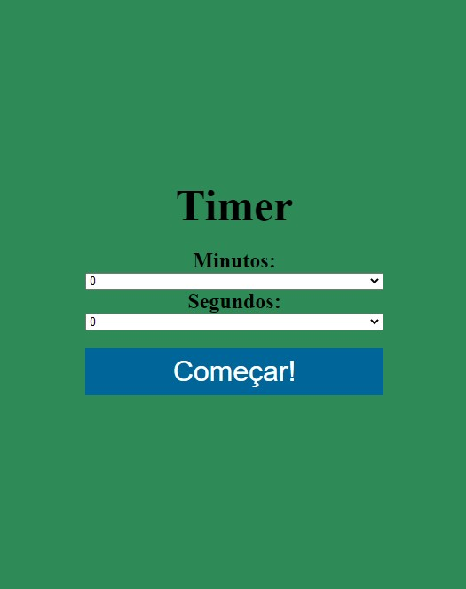

<!-- ABOUT THE PROJECT -->

## About The Project

    

        </i>
    

 
Here I am again to share one of my exercising projects, a timer webapp built with JavaScript.

### Built With

- [HTML]
- [CSS]
- [JavaScript]

<!-- CONTACT -->

## Contact

Salomão A. S. Nunes - [@salonunes](https://instagram.com/salonunes/) - contato@salomaonunes.com.br

Project Link: [https://github.com/salomaonunes/timer_project](https://github.com/salomaonunes/timer_project)
